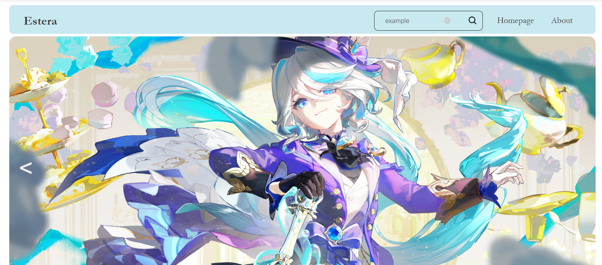
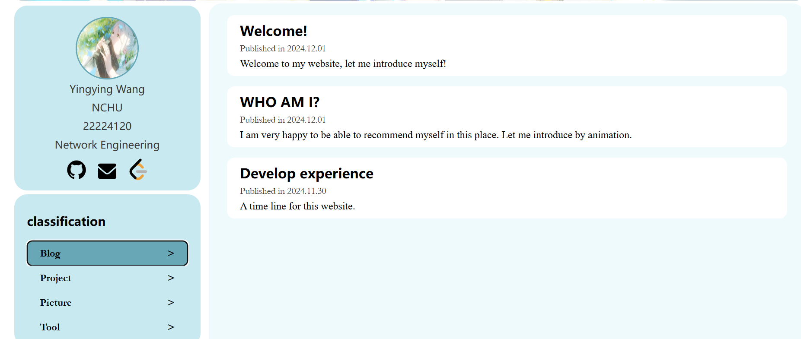

<a id="readme-top"></a>
<!--
*** Thanks for checking out the Personal Website of Estera. 
*** Hope a best experience.
-->

<!-- PROJECT LOGO -->
<br />
<div align="center">
  <a href="https://github.com/github_username/repo_name">
    
  </a>

<h3 align="center">Estera personal website</h3>

  <p align="center">
    A simple personal website using pure HTML, CSS, and JavaScript.
    <br />
    <a href="https://github.com/github_username/repo_name">View Demo</a>
    ·
    <a href="https://github.com/github_username/repo_name/issues/new?labels=bug&template=bug-report---.md">Report Bug</a>
    ·
    <a href="https://github.com/github_username/repo_name/issues/new?labels=enhancement&template=feature-request---.md">Request Feature</a>
  </p>
</div>


<!-- TABLE OF CONTENTS -->
<details>
  <summary>Table of Contents</summary>
  <ol>
    <li>
      <a href="#about-the-project">About The Project</a>
    </li>
    <li>
      <a href="#getting-started">Getting Started</a>
      <ul>
        <li><a href="#installation">Installation</a></li>
      </ul>
    </li>
    <li><a href="#usage">Usage</a></li>
    <li><a href="#contact">Contact</a></li>
    <li><a href="#acknowledgments">Acknowledgments</a></li>
  </ol>
</details>


<!-- ABOUT THE PROJECT -->
## About The Project


Special feature: In the display part of the blog, use ajax to send a request to the local area, use the DOMparse object to parse each blog (html file) that the request gets, and select a specific tag to assign it to the title, time, and introductory text of the blog display section.





 `huahuaguang`, `Estera Web page`, `2506669438@qq.com`,`personal website`

<!-- GETTING STARTED -->
## Getting Started

To get up and running locally, follow these simple example steps.

### Installation

1. Change git remote url to avoid accidental pushes to base project
   ```sh
   git remote set-url origin huahuaguang/EsteraWebPage
   git remote -v # confirm the changes
   ```

<!-- USAGE EXAMPLES -->
## Usage

Download the whole file and open "index.html" in Chrome or Edge.

<!-- CONTACT -->
## Contact

Estera - 2506669438@qq.com

Project Link: [https://github.com/huahuaguang/EsteraWebPage](https://github.com/huahuaguang/EsteraWebPage)

<p align="right">(<a href="#readme-top">back to top</a>)</p>